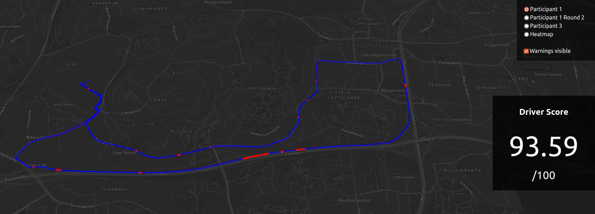

# Junction 2023 Pixieray: Peek behind the eyes

## Driving Change: In the Blink for Safety

Post-Junction notes:
This project was selected as the top project from 250 competing teams. In this repository
you can find the code used for data processing and visualisations, however you are not able
to test it in real time as the data format used is proprietary, and due to our agreement
during the event we are not able to share this data.

## Description
Distracted and fatigued driving poses widespread risks, impacting both individuals and society​.
This problem significantly impacts societal safety and well-being on a large scale​.
Our data analysis targets early signs of driver fatigue and mind wandering​
Anticipated outcomes: a potential 24% reduction in annual crashes, especially among inexperienced drivers, potentially saving lives and preventing injuries through active detection and post-drive feedback

## Visuals

[Live demo of post drive data interpretation](https://blinkbonanza.06ebee69-0772-4b23-a839-3a48c3de5bf9.fi-hel2.upcloudobjects.com/index.html)

[Video demonstration](https://www.youtube.com/watch?v=KfsboH4Km9o)

Post drive map:\

\
Analysis and error detection in eye movement:\

\
Analysis and error detection of head movement:\

## Installation
This project requires Python 3 to run. Several external libraries, such as pandas, numpy, matplotlib etc. are require to perform calculations and visualize the data.u

## Usage
The easiest way to get started is to use the included main.py script. By passing two files of specified data types, it is possible to generate visualizations of the collected data, as well as maps for post drive feedback.

## Authors
Team Cyber Surfers:\
David Enberg (david.enberg@aalto.fi)\
Alex Granlund (alex.granlund@aalto.fi)\
Markus Andersson (markus.o.andersson@aalto.fi)\
Johannes Peltola (johannes.e.peltola@aalto.fi)\

